# 🚀 LTI: Documento de Especificación Maestra (v2.0)
## *Sistema de Reclutamiento Inteligente con IA Contextual*

---

## Bloque 0: Métricas de Éxito y KPIs

### Métricas Clave del Producto

```yaml
Métricas de Éxito:
  Time-to-hire:
    objetivo: Reducción del 40% vs baseline
    medición: Desde publicación hasta aceptación de oferta
  
  Tasa de Automatización:
    objetivo: 70% de screenings sin intervención humana
    medición: Candidatos procesados automáticamente / total aplicaciones
  
  Quality of Hire:
    objetivo: Retention a 6 meses > 85%
    medición: Porcentaje de contratados que superan período de prueba
  
  Adopción de IA:
    objetivo: >90% de ofertas creadas con asistencia IA
    medición: Ofertas generadas con IA / total ofertas
  
  Precisión de Matching:
    objetivo: 85% de satisfacción en primeras 5 recomendaciones
    medición: Feedback de reclutadores sobre relevancia
```

---

## Bloque 1: Producto, Funcionalidades y Negocio

### 1. Visión del Producto

**LTI** es un ecosistema de reclutamiento inteligente diseñado para startups que necesitan escalar sin fricción. Nuestra visión es transformar el ATS tradicional de un simple repositorio de datos a un **Orquestador de Talento Agéntico**. Nos centramos en la **automatización inteligente**, la **colaboración en tiempo real** y la **asistencia contextual de IA** para acelerar decisiones críticas y amplificar las capacidades humanas.

### 2. Valor Añadido: Ventajas Competitivas

1. **IA Contextual y Adaptativa:** Matching semántico que entiende el contexto de los roles y aprende de las decisiones pasadas para mejorar sugerencias futuras.
2. **Colaboración en Tiempo Real:** Interfaz tipo "War Room" donde reclutadores y managers evalúan candidatos simultáneamente con feedback en vivo.
3. **Detección de Sesgos Inconscientes:** Análisis proactivo mediante IA para identificar y mitigar patrones de prejuicio en el proceso de selección.
4. **Automatización de "Toque Humano":** Generación de comunicaciones personalizadas y empáticas (rechazos, ofertas, invitaciones) mediante NLG (Generación de Lenguaje Natural).
5. **Insights Predictivos:** Dashboards que predicen el *time-to-hire* y el riesgo de no-aceptación de oferta basándose en datos históricos.
6. **Talent Pool Predictivo:** IA identifica candidatos rechazados que podrían encajar en futuras vacantes con auto-notificación contextual.

### 3. Funcionalidades Core

* **Creación de Ofertas:** Uso de IA para generar descripciones optimizadas para SEO y lenguaje inclusivo.
* **Publicación Multicanal:** Distribución automática en portales (LinkedIn, Indeed) y redes sociales con un clic.
* **Recepción y Parsing:** Extracción neuronal de datos de CVs para estructurar perfiles automáticamente.
* **Revisión con IA:** Screening automático y scoring predictivo basado en el ajuste semántico candidato-vacante.
* **Tests Online:** Integración de evaluaciones técnicas y psicométricas con resultados instantáneos.
* **Agenda Inteligente:** Scheduling automático que sincroniza calendarios de entrevistadores y candidatos sin intervención manual.
* **Onboarding:** Cierre del ciclo con generación de ofertas y traspaso automático de datos al HRIS.

### 4. Diagrama de Proceso de Reclutamiento

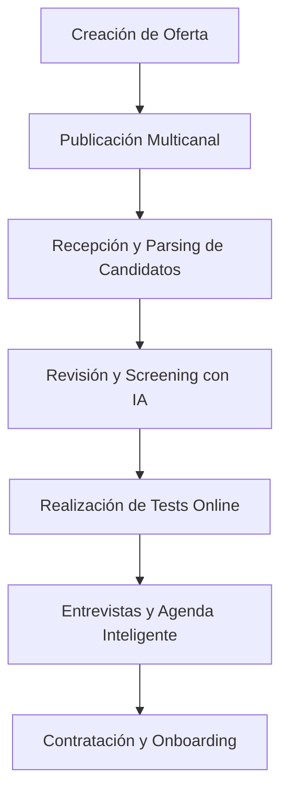

### 5. Diagrama de Estados de Candidato

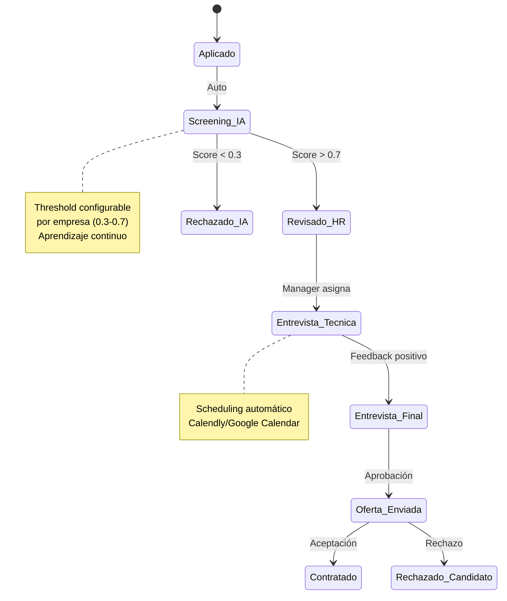

### 6. Lean Canvas

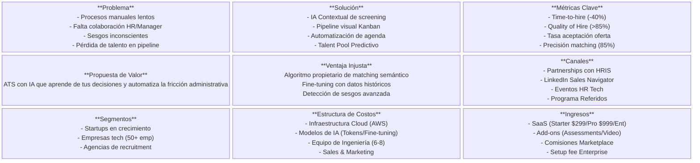

### 7. Modelo de Pricing

```yaml
Starter ($299/mes):
  - 3 vacantes activas
  - 200 aplicaciones/mes
  - Parsing básico
  - Matching estándar
  - Email support (24h)
  - Ideal: Startups <10 empleados

Pro ($999/mes):
  - 15 vacantes activas
  - Aplicaciones ilimitadas
  - IA avanzada + scoring predictivo
  - Colaboración tiempo real
  - API access (rate: 1000/h)
  - Priority support (4h)
  - Ideal: Empresas 10-200 empleados

Enterprise (Custom):
  - Vacantes ilimitadas
  - Custom AI fine-tuning
  - On-premise option
  - SLA 99.9% (99.95% opcional)
  - CSM dedicado
  - Training incluido
  - Ideal: >200 empleados o alta rotación

Add-ons disponibles:
  - Video entrevistas IA: +$199/mes
  - Assessments técnicos: +$299/mes
  - Marketplace integraciones: +$99/mes
```

---

## Bloque 2: Casos de Uso Detallados

### 1. Creación de Ofertas de Empleo

* **Descripción:** El Reclutador define los requisitos y la IA genera una vacante optimizada.
* **Actores:** Reclutador, Sistema LTI, Manager (Aprobador).
* **Precondiciones:** Reclutador autenticado y con permisos de creación.
* **Postcondiciones:** Vacante guardada en estado "Borrador" o enviada a aprobación.
* **Justificación:** Estandariza la calidad de las ofertas y reduce el tiempo de redacción manual.
* **Métrica asociada:** Reducción 80% tiempo redacción vs manual.

### 2. Publicación Automática en Portales

* **Descripción:** Distribución síncrona de la vacante aprobada a múltiples canales externos.
* **Actores:** Reclutador, APIs Externas (LinkedIn, Indeed).
* **Precondiciones:** Vacante aprobada y configurada con canales de publicación.
* **Postcondiciones:** Oferta visible en portales externos con enlaces de tracking únicos.
* **Justificación:** Maximiza el alcance del talento sin duplicar tareas administrativas.
* **Métrica asociada:** 100% publicaciones automáticas sin errores.

### 3. Recepción y Procesamiento de Solicitudes (Parsing)

* **Descripción:** Extracción automática de información estructurada de archivos adjuntos (PDF/Docx).
* **Actores:** Candidato, Sistema LTI (Servicio de IA).
* **Precondiciones:** Candidato envía aplicación vía portal o API.
* **Postcondiciones:** Perfil de candidato creado con habilidades, experiencia y score de match calculado.
* **Justificación:** Elimina la carga de lectura manual y permite el ranking objetivo inmediato.
* **Métrica asociada:** Precisión de extracción >95% en campos críticos.

### 4. Algoritmo de Matching Especificado

```python
class AdvancedMatchingEngine:
    def calculate_score(self, candidate, job):
        return {
            "semantic": 0.4 * self.bert_similarity(
                candidate.skills, 
                job.requirements
            ),
            "experience": 0.3 * self.years_match(
                candidate.experience, 
                job.min_years,
                job.max_years
            ),
            "culture": 0.2 * self.culture_fit(
                candidate.values, 
                job.culture_traits
            ),
            "potential": 0.1 * self.learning_agility(
                candidate.certifications,
                candidate.languages
            ),
            "bias_correction": self.detect_bias(
                candidate,
                job.historical_hires
            )
        }
    
    def bert_similarity(self, skills, requirements):
        # Modelo fine-tuned con datos históricos
        # Utiliza sentence-transformers/all-MiniLM-L6-v2
        return cosine_similarity(
            encode(skills), 
            encode(requirements)
        )
```

### Diagramas de Secuencia (Recepción y Procesamiento)

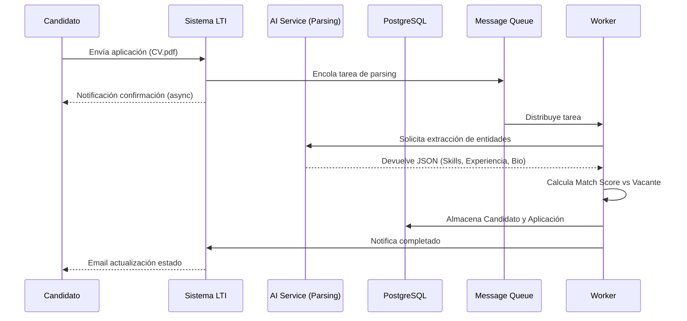

### Manejo de Errores en Parsing

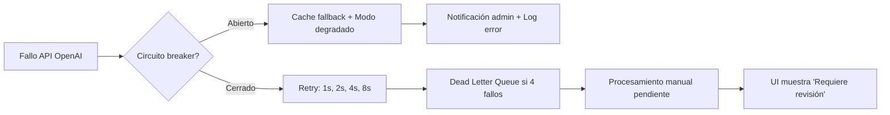

---

## Bloque 3: Modelo de Datos y Arquitectura de Sistema

### 1. Modelo de Datos (ER)

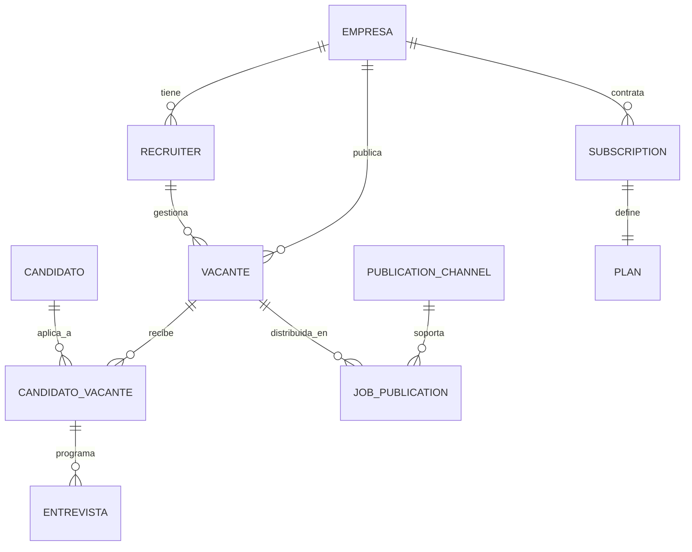

**Entidades Clave:**

* **CANDIDATO_VACANTE:** Almacena `score_match` (float 0-1), `feedback_ia` (JSONB), `red_flags` (array), `bias_indicators` (JSONB), `talent_pool_score` (float 0-1 para futuro matching)
* **VACANTE:** Define `requisitos_minimos` (JSONB), `criterios_screening` (JSONB), `historical_match_data` (JSONB), `culture_traits` (array)
* **SUBSCRIPTION:** Registra `plan_type`, `start_date`, `end_date`, `usage_metrics` (JSONB)

### 2. Decisión de Arquitectura: Hexagonal Modular

Se ha seleccionado una **Arquitectura Hexagonal Modular** implementada como un monolito bien delimitado inicialmente.

* **Comparativa:** El *Monolito* tradicional es rígido; los *Microservicios* añaden complejidad operativa prematura. La *Arquitectura Hexagonal* permite aislar la lógica de negocio (Dominio) de los cambios en APIs de terceros (LinkedIn, OpenAI) o bases de datos, facilitando una futura transición a microservicios si la carga lo requiere.
* **Estrategia de caché:** TTL configurable (jobs:1h, candidatos:5min, matching:10min) con invalidación por webhook.

### 3. Diagrama de Arquitectura de Alto Nivel

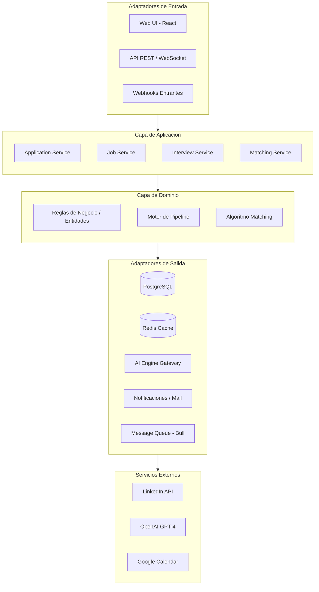

### 4. Estrategia de Caché Detallada

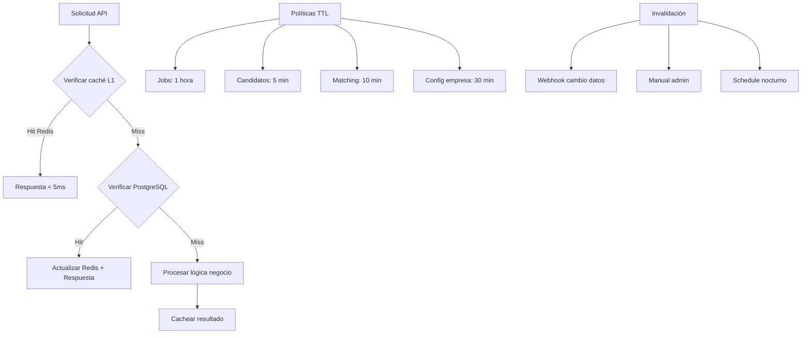

### 5. Integraciones con APIs Externas

```yaml
LinkedIn API:
  endpoints:
    - POST /jobs: Publicar oferta
    - GET /applications/metrics: Analytics aplicaciones
    - POST /webhooks: Eventos de aplicaciones
  rate_limits: 100 requests/day (plan gratuita)
  auth: OAuth 2.0 con refresh token
  fallback: Email a reclutador si falla

OpenAI API:
  model: GPT-4-turbo-preview
  fine_tuning: Cada 30 días con datos históricos
  timeout: 30 segundos
  fallback: GPT-3.5-turbo si timeout
  cache: Respuestas similares (hash embeddings)

Google Calendar:
  sync: Bidireccional cada 15 min
  webhooks: Cambios en eventos
  conflict_resolution: Prioridad usuario LTI
  rate_limit: 1,000,000 queries/día

LinkedIn (Indeed similar):
  batch_processing: Jobs actualizados cada hora
  retry_policy: Exponential backoff (1,2,4,8,16 min)
  dead_letter: Notificación Slack/Email
```

### 6. Plan de Onboarding Cliente

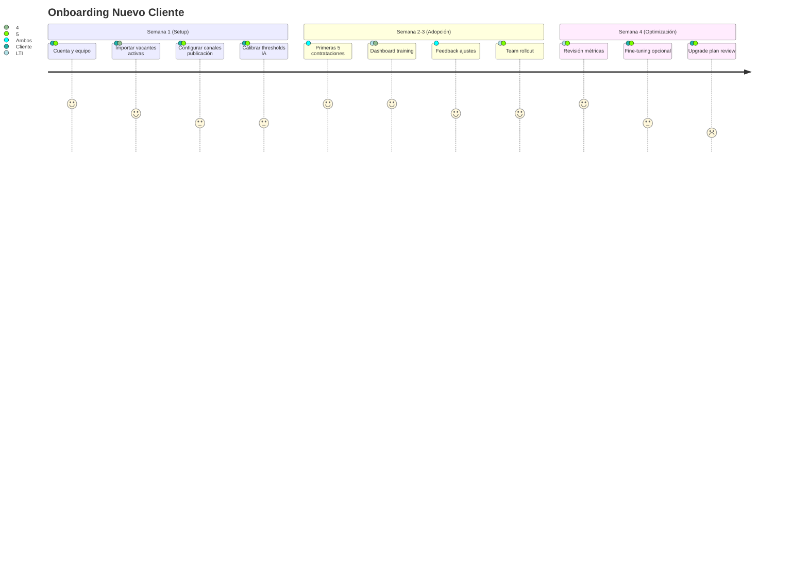

---

## Bloque 4: Inmersión Técnica (Diagramas C4)

### 1. Nivel 1: Contexto

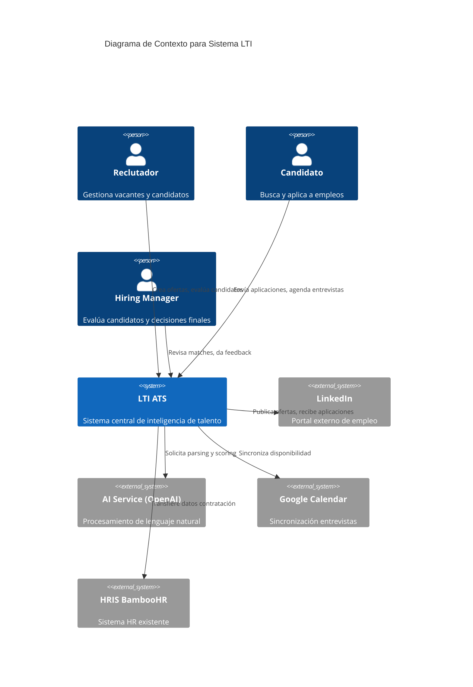

### 2. Nivel 2: Contenedores

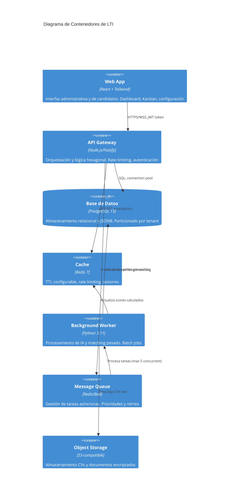

### 3. Nivel 3: Componentes (API Backend)

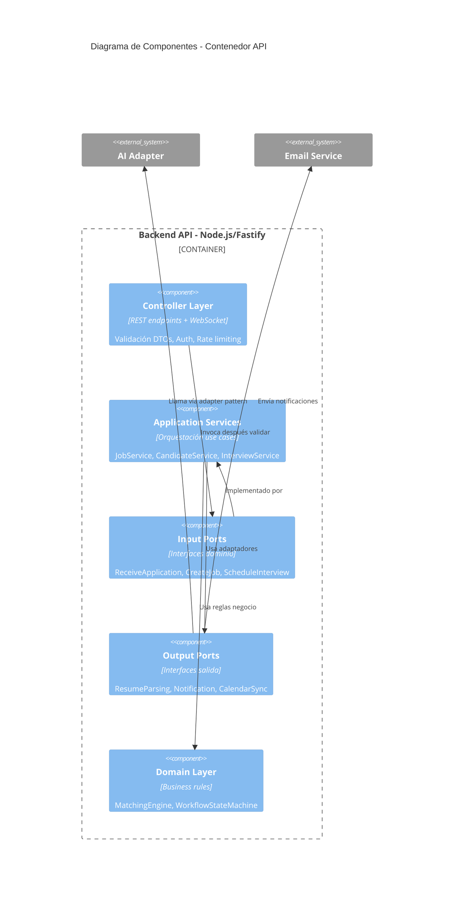

### 4. Nivel 4: Código (Clases Core)

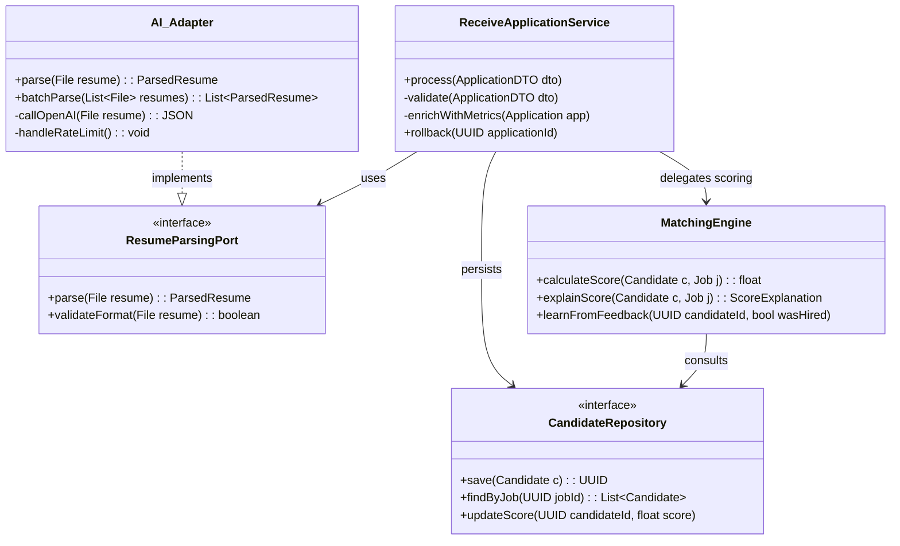

### 5. Seguridad y Privacidad

```yaml
GDPR / Ley de Datos (España):
  anonimización:
    - CVs anonimizados post-parsing (7 días)
    - Datos sensibles eliminados automáticamente
  retención:
    - Default: 24 meses (configurable 12-36)
    - Candidatos no contratados: purge anual
  exportabilidad:
    - Formato: JSON + PDF firmado
    - API endpoint: /export/candidate/{id}
    - Tiempo respuesta: < 30 segundos
  consentimiento:
    - Granular por canal (email, SMS, WhatsApp)
    - Revocable en cualquier momento
    - Audit trail de consents

Seguridad Técnica:
  encriptación:
    - CVs en reposo: AES-256-GCM
    - Datos sensibles: Field-level encryption
    - Keys: AWS KMS rotación mensual
  auditoría:
    - Audit trail de decisiones IA
    - Logs inmutables (7 años)
    - Acceso registrado (quién, cuándo, qué)
  acceso:
    - RBAC: Owner > Admin > Manager > Recruiter > Viewer
    - MFA obligatorio para Admin+
    - Session timeout: 8 horas (2 horas inactivo)
  compliance:
    - SOC 2 Type II (Q3 objetivo)
    - ISO 27001 (Q4 objetivo)
```

---

## Bloque 5: Roadmap y Estrategia

### Roadmap de Evolución (12 meses)

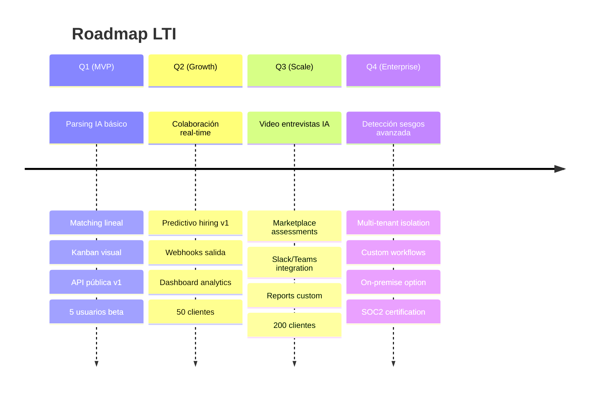

### Feature Diferenciador: Talent Pool Predictivo

```yaml
Funcionalidad:
  descripción:
    IA identifica candidatos rechazados que podrían
    encajar en futuras vacantes basándose en patrones
    históricos de contratación
  
  operación:
    - Batch diario: Re-evaluar 1000 candidatos rechazados
    - Threshold: 85% match con nuevas vacantes
    - Auto-notificación: Email + Dashboard alert
  
  métricas:
    - "Tasa de recuperación": Contratados de pool / total pool
    - Objetivo: 15-20% de contrataciones desde pool
  
  valor:
    - Reduce time-to-hire: 60% para roles recurrentes
    - Mejora employer branding (rechazos empáticos)
    - ROI: Recupera inversión en sourcing
```

---

## Bloque 6: Implementación y QA

### Checklist de Implementación Priorizado

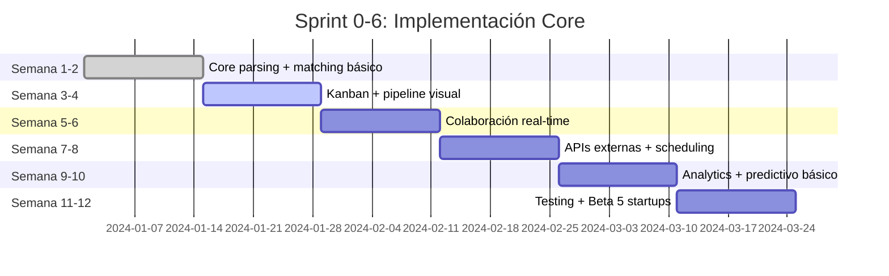

### Estrategia de Testing

```yaml
Unit Tests (Jest/Pytest - 80% coverage):
  - Core matching engine (threshold 0.95 precision)
  - State machine workflow
  - Validation rules

Integration Tests (Supertest - 100 APIs):
  - End-to-end application flow
  - External API mocks (LinkedIn, OpenAI)
  - Database transactions

Performance Tests (K6):
  - 1000 aplicaciones/minuto
  - Parsing batch: 50 CVs/segundo
  - P95 latency < 500ms

Security Tests (OWASP ZAP):
  - SQL injection (OWASP Top 10)
  - XSS, CSRF
  - Rate limiting bypass
  - JWT token brute force

QA Gates:
  - Code coverage ≥80% → Deploy staging
  - Performance P95 <500ms → Deploy prod
  - Zero critical security → Release
```

### Wireframes de Interfaz Clave

```text
VISTA DETALLE CANDIDATO (+ IA Insights):
┌──────────────────────────────────────────────────┐
│ Candidato: María García              [Score: 92%] │
│ DevOps Engineer → Senior/Lead role                │
├──────────────────────────────────────────────────┤
│ 📄 CV Parseado          🤖 IA Insights (AI)      │
│ • 8 años React          ✓ Stack match (94%)      │
│ • 3 años Kubernetes     ✓ Experience (8/5 req)   │
│ • Liderazgo 5 pers      ⚠️ Salario +20% rango    │
│ • Inglés C2             ✓ Cultural fit (88%)     │
│ • AWS Certified         ⚠️ Red flag: Overqualified│
├──────────────────────────────────────────────────┤
│ Timeline (Detección sesgos: No detectados)       │
│ ✅ Aplicó  (2 días)      Feedback IA: Positivo   │
│ ✅ Screening IA (match 0.89)                     │
│ ⏳ Review HR  [Marcar como ✅]  Nota: _____      │
│ ⚪ Entrevista técnica [Agendar →]                │
│ ⚪ Entrevista final                              │
│ ⚪ Oferta                                        │
├──────────────────────────────────────────────────┤
│ Actions: [👍 Shortlist] [👎 Rechazar] [💬 Chat]  │
│ Talent Pool Score: 94% → Guardar para futuro      │
└──────────────────────────────────────────────────┘

VISTA KANBAN PIPELINE:
┌────────────┬────────────┬────────────┬────────────┐
│ Aplicados  │ Screening  │ Entrevistas│ Oferta     │
│ (24)       │ IA (12)    │ (8)        │ (3)        │
├────────────┼────────────┼────────────┼────────────┤
│ Juan P.    │ María G.↑92│ Carlos R.  │ Ana M.     │
│ 2h ago     │ ⏳ Review HR│ 📅 Viernes │ 💰 Enviada │
│ Match: 67% │            │ Feedback: +│            │
├────────────┼────────────┼────────────┼────────────┤
│ Laura M.   │ Pedro A.↑88│ Sofia K.   │ Luis T.    │
│ 1d ago     │ 🔍 En revis.│ 📅 Mañana  │ ⏳ Espera  │
│ Match: 45% │            │            │            │
└────────────┴────────────┴────────────┴────────────┘
```

---

## Bloque 7: Monitoreo y Observabilidad

### Stack de Monitoreo

```yaml
Métricas (Prometheus + Grafana):
  business:
    - applications_per_hour
    - avg_match_score
    - time_to_hire_days
    - conversion_funnel (aplicado → oferta)
  
  technical:
    - api_latency_p95, p99
    - error_rate (target <0.1%)
    - queue_length (alerta >1000)
    - ai_service_availability (target >99.5%)
  
  infrastructure:
    - cpu_usage, memory_usage
    - db_connections
    - cache_hit_ratio

Logs (ELK Stack):
  - Structured JSON logs
  - Retention: 30 días hot, 90 días cold
  - Correlation ID por request
  - Alertas: ERROR level en prod

Tracing (Jaeger):
  - Sampling rate: 1% en prod, 100% staging
  - Trazas completas transacciones críticas
  - DB query análisis

Alertas (PagerDuty):
  - Critical: API down, DB down (notificar 24/7)
  - High: AI service timeout >30s (horario laboral)
  - Medium: Queue >5000 (email)
  - Low: Batch job failure (dashboard)
```

---

## Apéndices

### A. Glosario de Términos

- **ATS:** Applicant Tracking System
- **Parsing:** Extracción automática de datos de CVs
- **Matching semántico:** Comparación contextual usando NLP
- **NLG:** Natural Language Generation
- **HRIS:** Human Resources Information System
- **Fine-tuning:** Ajuste de modelo IA con datos específicos
- **Dead Letter Queue:** Cola para mensajes fallidos

### B. Referencias Técnicas

- **Arquitectura Hexagonal:** Alistair Cockburn
- **Fine-tuning BERT:** Hugging Face transformers
- **Rate limiting:** Token bucket algorithm
- **Event sourcing:** Para auditoría de decisiones IA

### C. Equipo Propuesto (Fase 1)

```yaml
Core Team (6-8 personas):
  - 1 PM (tiempo completo)
  - 2 Backend (Node.js + Python)
  - 1 Frontend (React + TypeScript)
  - 1 ML Engineer (fine-tuning)
  - 1 DevOps (AWS + Kubernetes)
  - 1 QA (testing automatizado)
  - 0.5 UX/UI (consultoría)

Adicionales Fase 2:
  - 1 Sales Engineer
  - 1 Customer Success
  - 1 Data Analyst
```

---

## 📋 Document Version Control

| Versión | Fecha | Cambios | Autor |
|---------|-------|---------|-------|
| v1.0 | 2024-01-15 | Documento inicial | Equipo LTI |
| v2.0 | 2024-01-22 | Integración mejoras: KPIs, seguridad, roadmap, wireframes, caching, manejo errores | Equipo LTI + Revision |

---

**Documento generado:** Especificación Maestra LTI v2.0  
**Próxima revisión:** Q2 2024  
**Estado:** Aprobado para desarrollo
