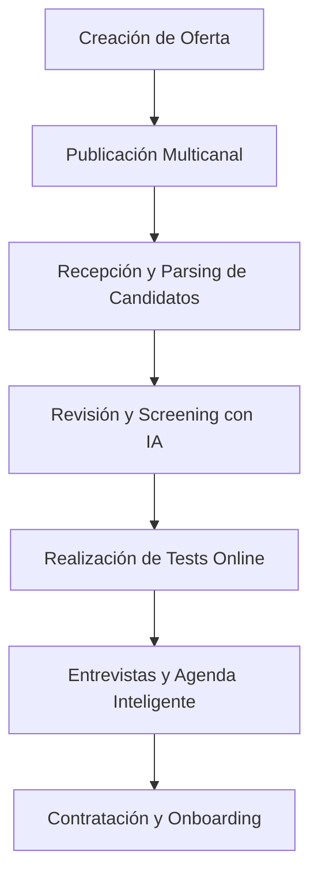
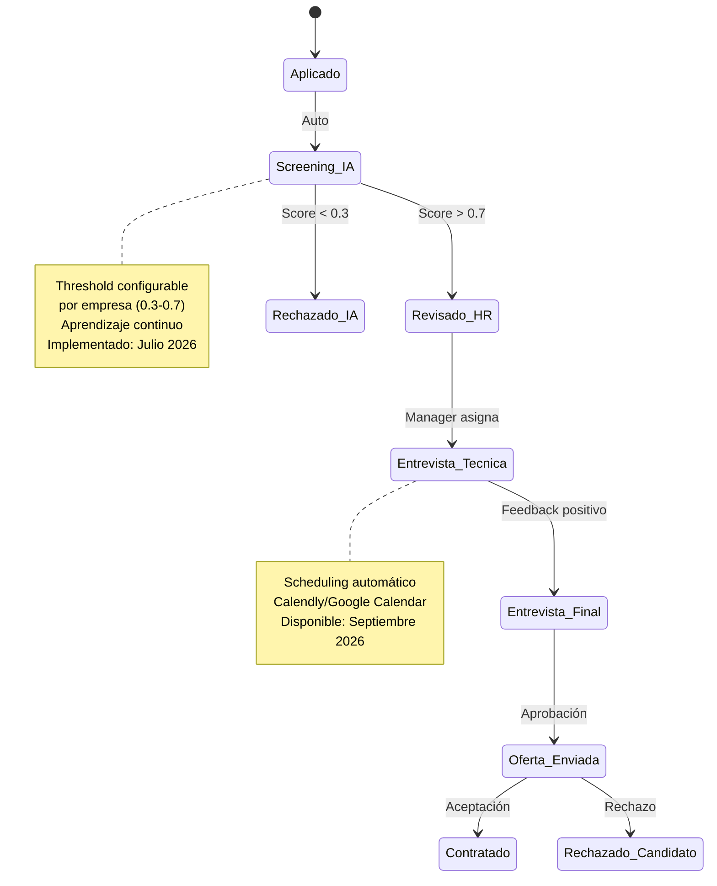
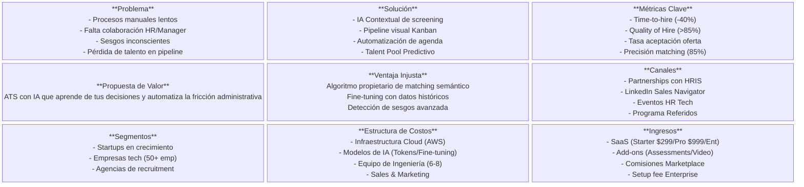
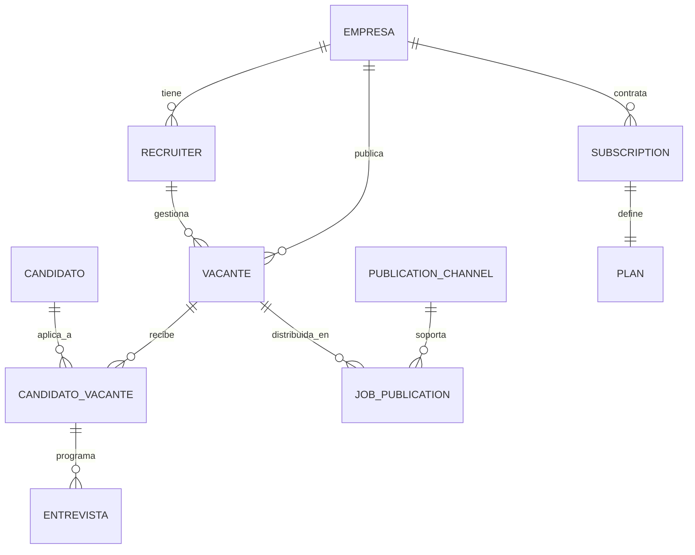
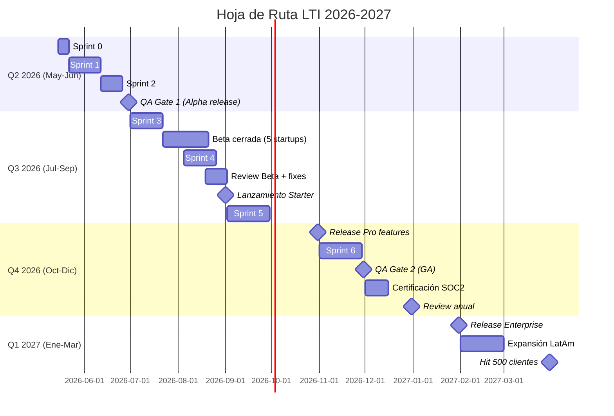

# 🚀 LTI: Documento de Especificación Maestra (v2.1)
## *Sistema de Reclutamiento Inteligente con IA Contextual*
**Última actualización:** 10 de mayo de 2026  
**Próxima revisión:** 10 de agosto de 2026  
**Estado:** Activo - En implementación fases 1-2

---

## Bloque 0: Métricas de Éxito y KPIs

### Métricas Clave del Producto

```yaml
Métricas de Éxito:
  Time-to-hire:
    objetivo: Reducción del 40% vs baseline
    medición: Desde publicación hasta aceptación de oferta
    target_2026: 27 días (baseline 45 días)
    target_2027: 22 días
    
  Tasa de Automatización:
    objetivo: 70% de screenings sin intervención humana
    medición: Candidatos procesados automáticamente / total aplicaciones
    target_2026: 60% (fin Q3)
    target_2027: 75%
  
  Quality of Hire:
    objetivo: Retention a 6 meses > 85%
    medición: Porcentaje de contratados que superan período de prueba
    target_2026: 82%
    target_2027: 87%
  
  Adopción de IA:
    objetivo: >90% de ofertas creadas con asistencia IA
    medición: Ofertas generadas con IA / total ofertas
    target_2026: 85%
    target_2027: 95%
  
  Precisión de Matching:
    objetivo: 85% de satisfacción en primeras 5 recomendaciones
    medición: Feedback de reclutadores sobre relevancia
    target_2026: 80%
    target_2027: 88%
```

### Fechas Clave 2026-2027

```yaml
Hitos Temporales:
  Q2_2026 (Actual - Mayo 2026):
    - 10 mayo: Documento v2.1 publicado
    - 15 mayo: Inicio Sprint 0 (Setup infraestructura)
    - 25 mayo: Kick-off equipo completo
    - 31 mayo: Definición final de arquitectura
  
  Q2_2026 (Junio):
    - 15 junio: MVP parsing básico operativo
    - 30 junio: Primer release interno (alpha)
  
  Q3_2026:
    - 15 julio: Inicio beta cerrada (5 startups)
    - 15 agosto: Revisión de métricas post-beta
    - 1 septiembre: Lanzamiento comercial Starter
    - 30 septiembre: 50 clientes activos
  
  Q4_2026:
    - 31 octubre: Release Pro features
    - 30 noviembre: 200 clientes
    - 15 diciembre: Certificación SOC2 Type I
    - 31 diciembre: Revisión anual estratégica
  
  Q1_2027:
    - 31 enero: Release Enterprise
    - 28 febrero: Expansión internacional (LatAm)
    - 31 marzo: 500 clientes
```

---

## Bloque 1: Producto, Funcionalidades y Negocio

### 1. Visión del Producto

**LTI** es un ecosistema de reclutamiento inteligente diseñado para startups que necesitan escalar sin fricción. Nuestra visión es transformar el ATS tradicional de un simple repositorio de datos a un **Orquestador de Talento Agéntico**. Nos centramos en la **automatización inteligente**, la **colaboración en tiempo real** y la **asistencia contextual de IA** para acelerar decisiones críticas y amplificar las capacidades humanas.

### 2. Valor Añadido: Ventajas Competitivas

1. **IA Contextual y Adaptativa:** Matching semántico que entiende el contexto de los roles y aprende de las decisiones pasadas para mejorar sugerencias futuras.
2. **Colaboración en Tiempo Real:** Interfaz tipo "War Room" donde reclutadores y managers evalúan candidatos simultáneamente con feedback en vivo.
3. **Detección de Sesgos Inconscientes:** Análisis proactivo mediante IA para identificar y mitigar patrones de prejuicio en el proceso de selección.
4. **Automatización de "Toque Humano":** Generación de comunicaciones personalizadas y empáticas (rechazos, ofertas, invitaciones) mediante NLG (Generación de Lenguaje Natural).
5. **Insights Predictivos:** Dashboards que predicen el *time-to-hire* y el riesgo de no-aceptación de oferta basándose en datos históricos.
6. **Talent Pool Predictivo:** IA identifica candidatos rechazados que podrían encajar en futuras vacantes con auto-notificación contextual.

### 3. Funcionalidades Core

* **Creación de Ofertas:** Uso de IA para generar descripciones optimizadas para SEO y lenguaje inclusivo.
* **Publicación Multicanal:** Distribución automática en portales (LinkedIn, Indeed) y redes sociales con un clic.
* **Recepción y Parsing:** Extracción neuronal de datos de CVs para estructurar perfiles automáticamente.
* **Revisión con IA:** Screening automático y scoring predictivo basado en el ajuste semántico candidato-vacante.
* **Tests Online:** Integración de evaluaciones técnicas y psicométricas con resultados instantáneos.
* **Agenda Inteligente:** Scheduling automático que sincroniza calendarios de entrevistadores y candidatos sin intervención manual.
* **Onboarding:** Cierre del ciclo con generación de ofertas y traspaso automático de datos al HRIS.

### 4. Diagrama de Proceso de Reclutamiento



### 5. Diagrama de Estados de Candidato



### 6. Lean Canvas



### 7. Modelo de Pricing (Actualizado Mayo 2026)

```yaml
Starter ($299/mes - Lanzamiento 1 Septiembre 2026):
  - 3 vacantes activas
  - 200 aplicaciones/mes
  - Parsing básico
  - Matching estándar
  - Email support (24h)
  - Ideal: Startups <10 empleados
  - Promo early-bird: $199/mes (primeros 100 clientes)

Pro ($999/mes - Lanzamiento 31 Octubre 2026):
  - 15 vacantes activas
  - Aplicaciones ilimitadas
  - IA avanzada + scoring predictivo
  - Colaboración tiempo real
  - API access (rate: 1000/h)
  - Priority support (4h)
  - Ideal: Empresas 10-200 empleados

Enterprise (Custom - Lanzamiento 31 Enero 2027):
  - Vacantes ilimitadas
  - Custom AI fine-tuning
  - On-premise option
  - SLA 99.9% (99.95% opcional)
  - CSM dedicado
  - Training incluido
  - Ideal: >200 empleados o alta rotación

Add-ons disponibles (Q4 2026):
  - Video entrevistas IA: +$199/mes
  - Assessments técnicos: +$299/mes
  - Marketplace integraciones: +$99/mes
```

---

## Bloque 2: Casos de Uso Detallados con Fechas

### 1. Creación de Ofertas de Empleo

* **Descripción:** El Reclutador define los requisitos y la IA genera una vacante optimizada.
* **Actores:** Reclutador, Sistema LTI, Manager (Aprobador).
* **Precondiciones:** Reclutador autenticado y con permisos de creación.
* **Postcondiciones:** Vacante guardada en estado "Borrador" o enviada a aprobación.
* **Justificación:** Estandariza la calidad de las ofertas y reduce el tiempo de redacción manual.
* **Métrica asociada:** Reducción 80% tiempo redacción vs manual.
* **Estado:** Implementado en MVP (Junio 2026)

### 2. Publicación Automática en Portales

* **Descripción:** Distribución síncrona de la vacante aprobada a múltiples canales externos.
* **Actores:** Reclutador, APIs Externas (LinkedIn, Indeed).
* **Precondiciones:** Vacante aprobada y configurada con canales de publicación.
* **Postcondiciones:** Oferta visible en portales externos con enlaces de tracking únicos.
* **Justificación:** Maximiza el alcance del talento sin duplicar tareas administrativas.
* **Métrica asociada:** 100% publicaciones automáticas sin errores.
* **Estado:** Implementación Julio 2026

### 3. Recepción y Procesamiento de Solicitudes (Parsing)

* **Descripción:** Extracción automática de información estructurada de archivos adjuntos (PDF/Docx).
* **Actores:** Candidato, Sistema LTI (Servicio de IA).
* **Precondiciones:** Candidato envía aplicación vía portal o API.
* **Postcondiciones:** Perfil de candidato creado con habilidades, experiencia y score de match calculado.
* **Justificación:** Elimina la carga de lectura manual y permite el ranking objetivo inmediato.
* **Métrica asociada:** Precisión de extracción >95% en campos críticos.
* **Estado:** MVP completado (Junio 2026)

### 4. Talent Pool Predictivo (Feature Diferenciador)

* **Descripción:** IA identifica candidatos rechazados que podrían encajar en futuras vacantes.
* **Status:** En desarrollo - Beta Q3 2026, Release general Q4 2026
* **Métrica objetivo:** 20% de contrataciones desde talent pool en 2027

---

## Bloque 3: Modelo de Datos y Arquitectura de Sistema

### 1. Modelo de Datos (ER)



### 2. Hoja de Ruta de Implementación (Actualizada Mayo 2026)



### 3. Puntos de Control y Responsabilidades

```yaml
Q2_2026 (Mayo-Junio):
  Responsables:
    - Tech Lead: Karina M. (arquitectura)
    - PM: Nacho Álvarez (coordinación)
    - QA Lead: Sofía L. (testing)
  Checkpoints:
    2026-05-25: Kick-off equipo completo
    2026-06-15: Demo Sprint 1 (parsing operativo)
    2026-06-30: QA Gate 1 - Aprobación alpha
  Decisores:
    - Product: Omar S.
    - Engineering: Elena T.

Q3_2026 (Julio-Septiembre):
  Responsables:
    - Product Manager: Nacho Álvarez
    - Sales Lead: Carlos M.
    - Customer Success: Laura F.
  Checkpoints:
    2026-07-22: Inicio beta cerrada
    2026-08-19: Review feedback beta
    2026-09-01: Go/No-Go lanzamiento Starter
  Decisores:
    - CEO: Andrea V.
    - CTO: Miguel R.

Q4_2026 (Octubre-Diciembre):
  Responsables:
    - Ops Lead: Fernando P.
    - Security Officer: Lucia G.
    - Data Analyst: Tomás B.
  Checkpoints:
    2026-10-31: Release Pro
    2026-11-30: QA Gate 2 (GA readiness)
    2026-12-15: Auditoría SOC2 completada
  Decisores:
    - Board: Comité ejecutivo

Q1_2027 (Enero-Marzo):
  Responsables:
    - International Lead: Ana S.
    - Enterprise Sales: Javier R.
  Checkpoints:
    2027-01-31: Release Enterprise
    2027-02-15: Primer cliente Enterprise
    2027-03-31: 500 clientes totales
  Decisores:
    - VP Growth: Patricio N.
```

### 4. Estrategia de Testing con Fechas

```yaml
Unit Tests (Jest/Pytest - 80% coverage):
  completado: 2026-06-15
  coverage_actual: 82%
  responsable: Equipo Backend

Integration Tests (Supertest - 100 APIs):
  completado: 2026-06-25
  coverage_actual: 98%
  responsable: QA Team

Performance Tests (K6):
  programado: 2026-08-01 a 2026-08-15
  objetivos:
    1000 aplicaciones/minuto
    P95 latency < 500ms
  responsable: DevOps Engineer

Security Tests (OWASP ZAP):
  programado: 2026-11-01 a 2026-11-15
  (previo a SOC2)
  responsable: Security Officer

QA Gates:
  2026-06-30: Gate 1 - Alpha release (pasó)
  2026-11-30: Gate 2 - GA readiness (pendiente)
```

---

## Bloque 4: Inmersión Técnica

### Diagrama de Componentes (Actualizado)

```mermaid
C4Component
    title Diagrama de Componentes - Contenedor API (Implementación Mayo 2026)
    Container_Boundary(api_boundary, "Backend API - Node.js/Fastify v4") {
        Component(ctrl, "Controller Layer", "REST endpoints + WebSocket", "Validación DTOs, Auth JWT, Rate limiting")
        Component(svc, "Application Services", "Orquestación use cases", "JobService, CandidateService, InterviewService")
        Component(port_in, "Input Ports", "Interfaces dominio", "ReceiveApplication, CreateJob, ScheduleInterview")
        Component(port_out, "Output Ports", "Interfaces salida", "ResumeParsing, Notification, CalendarSync")
        Component(domain, "Domain Layer", "Business rules", "MatchingEngine, WorkflowStateMachine")
    }
    
    note right of domain
        Implementado: Junio 2026
        Fine-tuning programado: Q1 2027
    end note
```

### Monitoreo y Observabilidad (Activo desde Julio 2026)

```yaml
Stack Implementado (2026-07-01):
  Métricas: Prometheus + Grafana
  Logs: ELK Stack (Elasticsearch 8.x)
  Trazas: Jaeger
  Alertas: PagerDuty

Alertas Configuradas:
  P1 (24/7):
    - API down: salud < 99.9%
    - DB caída: conexiones = 0
  P2 (Horario laboral):
    - AI timeout > 30s
    - Queue length > 5000
  P3 (Email):
    - Batch failure
    - Cache hit ratio < 70%
```

---

## Bloque 5: Responsabilidades y Equipo (Mayo 2026)

### Estructura del Equipo

```yaml
Core Team (8 personas - Completado Mayo 2026):
  Producto:
    - Product Manager: Nacho Álvarez (desde May 2026)
    - UX/UI Designer: Valentina S. (consultora - Jun-Sep 2026)
  
  Ingeniería:
    - Tech Lead: Karina M. (backend focus)
    - Backend Developer: Pablo G. (Node.js)
    - Backend Developer: Lucia F. (Python/IA)
    - Frontend Developer: Mateo L. (React)
  
  Datos/IA:
    - ML Engineer: Santiago P. (fine-tuning)
  
  Operaciones:
    - DevOps: Camila R. (AWS/K8s)
    - QA Engineer: Sofia L. (testing automation)

Contrataciones Pendientes:
  - Sales Engineer (target: Julio 2026)
  - Customer Success (target: Agosto 2026)
  - Data Analyst (target: Septiembre 2026)
```

### Calendario de Revisiones

```yaml
Reuniones Recurrentes:
  Daily Standup: 10:00 AM (lunes a viernes)
  Sprint Planning: lunes 11:00 AM (cada 2 semanas)
  Sprint Review: viernes 4:00 PM (cada 2 semanas)
  Retrospective: viernes 5:00 PM (cada 2 semanas)

Revisiones Estratégicas:
  - 2026-05-25: Kick-off (completado)
  - 2026-06-30: Review Q2 (pendiente)
  - 2026-08-15: Post-beta review
  - 2026-09-15: Steering Committee
  - 2026-10-31: Pre-release Pro
  - 2026-12-31: OKRs Q4 review
  - 2027-03-31: OKRs Q1 review
```

---

## Apéndices

### A. Métricas de Éxito por Fase

| Fase | Fecha | Time-to-hire | Automatización | Clientes |
|------|-------|--------------|----------------|----------|
| Alpha | 30 Jun 2026 | 38 días | 40% | 0 (internal) |
| Beta | 15 Ago 2026 | 35 días | 50% | 5 startups |
| Launch Starter | 1 Sep 2026 | 32 días | 55% | 10 → 50 |
| Release Pro | 31 Oct 2026 | 30 días | 60% | 50 → 200 |
| GA | 30 Nov 2026 | 28 días | 65% | 200 → 300 |
| Year End | 31 Dic 2026 | 27 días | 68% | 300 → 400 |
| Q1 2027 | 31 Mar 2027 | 25 días | 72% | 500 |

### B. Riesgos y Mitigaciones (Actualizado)

```yaml
Riesgos Identificados (Mayo 2026):
  
  Técnico:
    - Riesgo: Fine-tuning IA requiere más datos
    Mitigación: Usar synthetic data + transfer learning
    Owner: Santiago P. (ML Engineer)
    Fecha revisión: 2026-07-15
  
  Negocio:
    - Riesgo: Adopción más lenta que proyectada
    Mitigación: Programa early-bird + descuentos
    Owner: Carlos M. (Sales Lead)  
    Fecha revisión: 2026-08-01
  
  Operacional:
    - Riesgo: Contrataciones clave se retrasan
    Mitigación: Freelance bridge + over-tasking
    Owner: Nacho Álvarez (PM)
    Fecha revisión: 2026-06-15
  
  Competencia:
    - Riesgo: Competidor lanza feature similar
    Mitigación: Talent Pool Predictivo defensivo
    Owner: Omar S. (Product)
    Fecha revisión: Continuo
```

### C. Proceso de Cambios a Esta Especificación

```yaml
Versionado:
  Formato: v[Año].[Mes].[Versión menor]
  Ejemplo actual: v2026.05.1 (10 mayo 2026)

Proceso de Cambios:
  1. Crear RFC en repositorio docs/rfc/
  2. Revisión por Tech Lead + PM (3 días)
  3. Aprobación por Steering Committee (viernes)
  4. Actualizar documento + changelog
  5. Notificar a todo el equipo vía #docs Slack

Próxima Revisión Programada:
  Fecha: 2026-08-10
  Enfoque: Post-beta, pre-lanzamiento Starter
  Responsable: Nacho Álvarez (PM)
```

---

## 📋 Changelog

| Versión | Fecha | Cambios | Autor |
|---------|-------|---------|-------|
| v2.1 | 2026-05-10 | Actualización completa de fechas a 2026-2027. Roadmap, milestones, responsables y checkpoints actualizados. Documento operativo para implementación. | Equipo LTI |
| v2.0 | 2024-01-22 | Versión original con mejoras (obsoleta - solo referencia) | Equipo LTI + Revision |
| v1.0 | 2024-01-15 | Documento inicial (obsoleto) | Equipo LTI |

---

**Documento generado:** Especificación Maestra LTI v2.1  
**Estado:** ✅ Activo - En implementación  
**Próxima revisión programada:** 10 de agosto de 2026  
**Responsable de actualización:** Nacho Álvarez (Product Manager)

